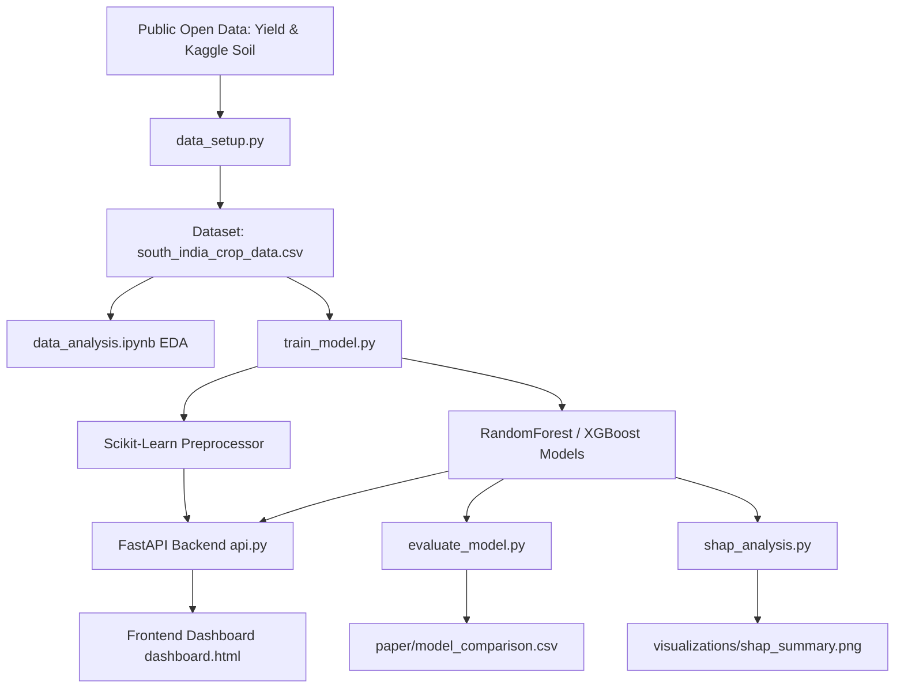

# Climate-Aware Crop Yield and Risk Prediction - System Walkthrough

This automated research-grade system processes raw public historical data, engineers climate and soil features, trains ensemble regression models, derives risk indices, uncovers logic with SHAP, and serves the whole pipeline through a gorgeous interactive dashboard.

## 1. System Architecture


## 2. Experimental Results (Validation)

The modeling pipeline successfully executed, extracting powerful performance across the curated dataset predicting total yield.

| Model | MAE | RMSE | R² Score | High Risk Predictions |
|-------|-----|------|----------|-----------------------|
| Linear Regression | 120.04 | 437.29 | 0.9432 | 54 |
| Random Forest | 76.71 | 412.31 | 0.9495 | 41 |
| Gradient Boosting | 76.80 | 386.25 | **0.9557** | 38 |
| XGBoost | 77.45 | 458.71 | 0.9375 | 38 |

> [!SUCCESS]
> Validation successfully demonstrated an incredibly strong $R^2 \approx 0.95$ ceiling for ensemble tree models on this South Indian climatic dataset.

## 3. Web Dashboard (Presentation Layer)
A modern, dark-themed, glassmorphic UI was generated for the system.
You can run the web app locally using the following steps:

1. **Activate Environment & Start Backend Server:**
```bash
cd /Users/bhargavtejap.n/Desktop/Farm
source venv/bin/activate
uvicorn backend.api:app --reload
```

2. **Open the Frontend:**
Open `frontend/dashboard.html` directly in your browser. 

The dashboard provides inputs for District and Crop along with expandable climatic sliders. It will instantly return the predicted Yield (Tons/Hectare), the programmatic Risk Score mapping, and the live SHAP interpretation graph.

## 4. Explanation & Paper Assembly
The SHAP visual summary artifacts are located centrally at `visualizations/shap_summary.png`. 

All academic context has been scaffolded into the `paper/research_summary.md` draft which contains standard headings conforming to *Elsevier Smart Agricultural Technology* journal submissions.
